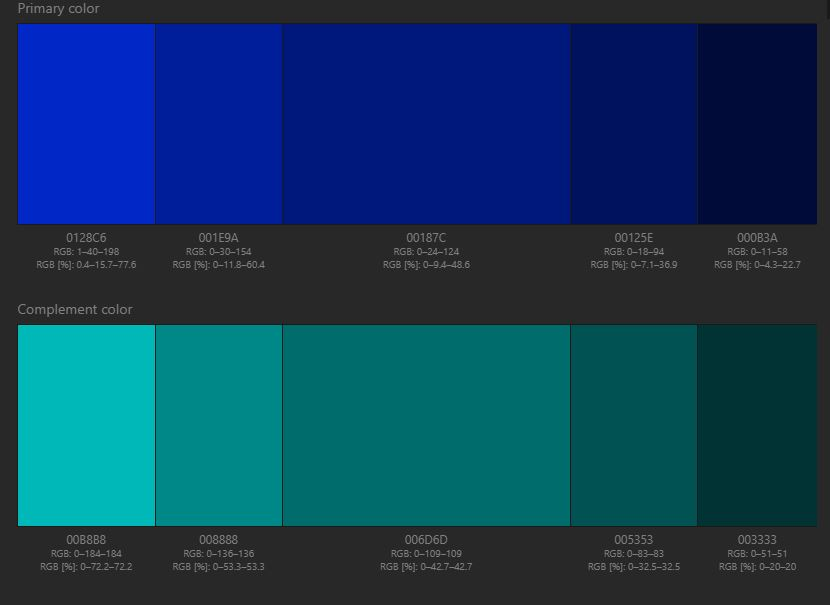
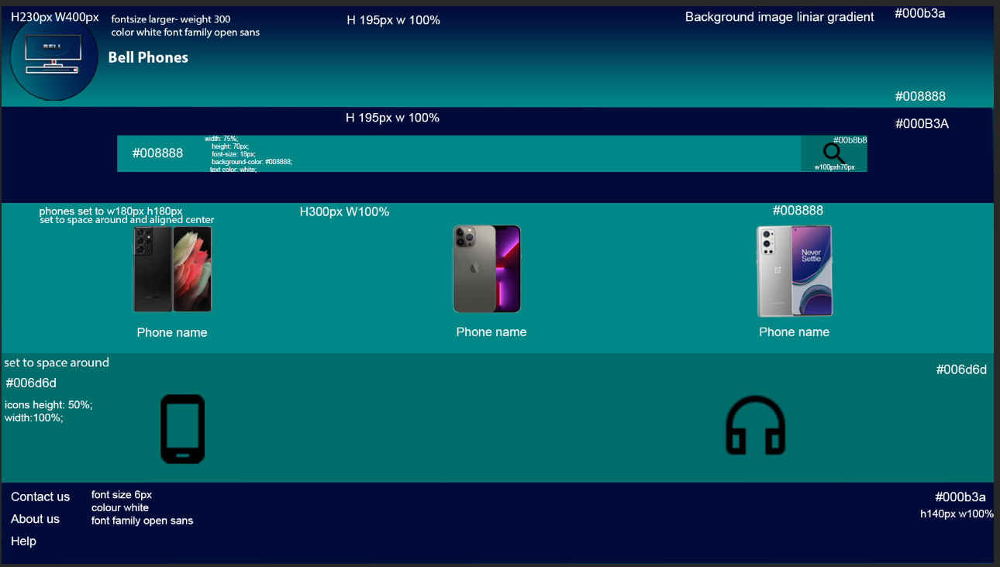
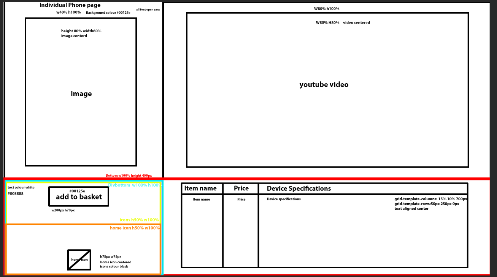
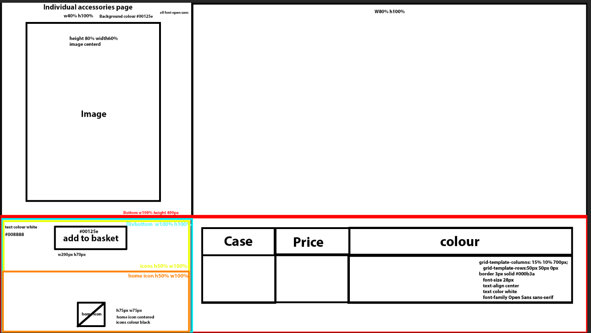
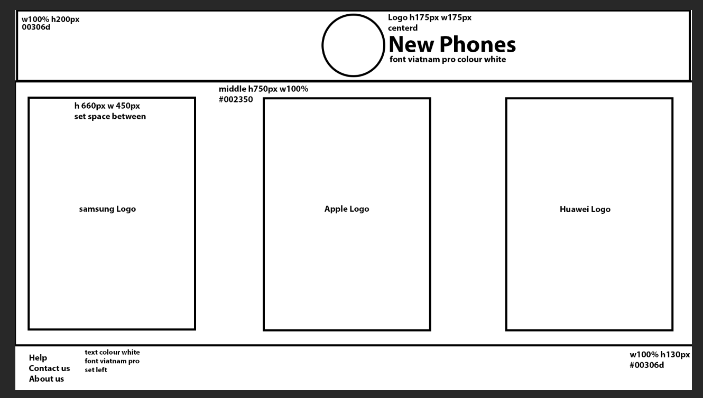
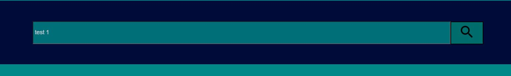
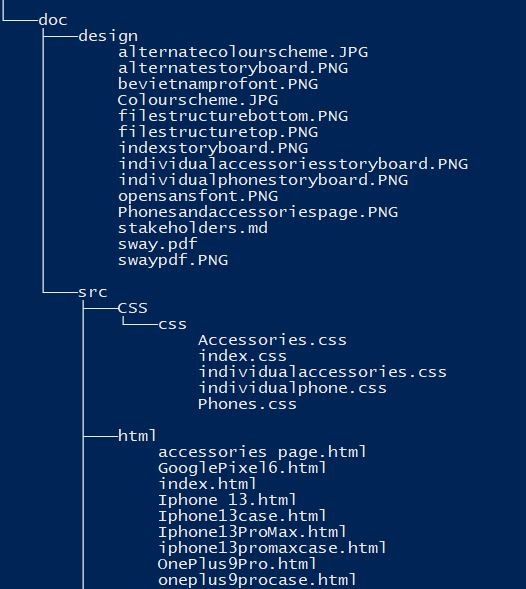
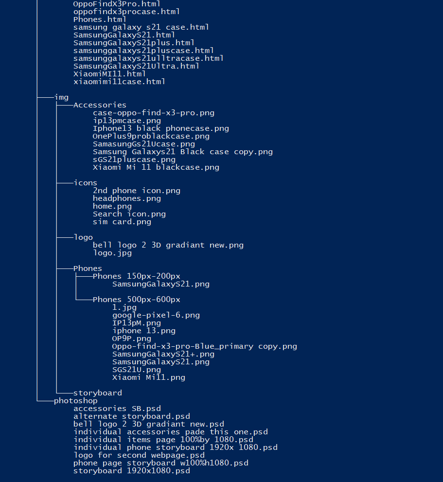
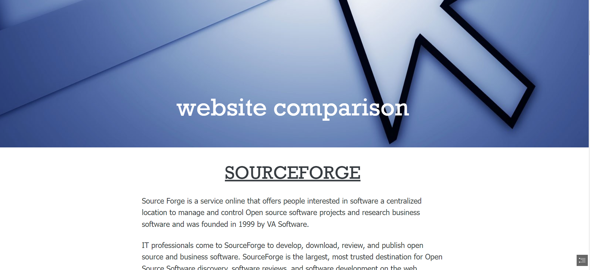

# Stakeholders

The stakeholders in an enterprise are any groups with an interest with how well it
satisfies their needs.

# Sway Link
https://sway.office.com/vTypuTavjVAqCoFl?ref=Link

## Customers
+ quick loading
  + needs to load within a couple seconds
+ simple (easy to navigate)
+ product information
  + phone prices
  + device specifications
  + recomended phones
+ easily accessable

## Designers
+ well documented
+ maintainable
+ easy to test 
+ standards
+ timing
  + how long will it take to make?
  + how long have the been given to create?

## Owners 
+ cheap 
+ needs to look good 
+ professional and functional
+ genarate business

# Colour schemes
Color Palette by Paletton.com
#####  Palette URL: http://paletton.com/#uid=a3R3i0k++mOZDEL+Wsq+Yhm+RaK

 

   I have decided to use these colours because they are similar the the owners logo and the owner would like them to look similar.
   
   I will use the primary and secondary colours in backgrounds in my website, buttons and searchbars.

## Alternate colour scheme
Color Palette by Paletton.com
#####  Palette URL: http://paletton.com/#uid=1000u0kWL93GVi7QBdQ+f3L++00

I decided to use this colour for the alternate website design because I noticed some of the websites I was referencing used it like tesco mobile.

# Fonts
## Website one
for website one i have decided to use the Open Sans font because it was optimised for web layouts and mobile interfaces 
i found it on google fonts

<link rel="preconnect" href="https://fonts.googleapis.com">
<link rel="preconnect" href="https://fonts.gstatic.com" crossorigin>
<link href="https://fonts.googleapis.com/css2?family=Corinthia&display=swap" rel="stylesheet">

website used for phones https://www.techradar.com/uk/news/best-phone

## Website two
for website two, i will use Be Vietnam Pro because it is a Neo Grotesk which is well suited to tech companies. i got it from google fonts.

<link rel="preconnect" href="https://fonts.googleapis.com">
<link rel="preconnect" href="https://fonts.gstatic.com" crossorigin>
<link href="https://fonts.googleapis.com/css2?family=Corinthia&display=swap" rel="stylesheet">

# Storyboards
## Home page 

## Individual Phones

## Individual Accessories 

## Accessories and phone page storyboard

The accessories and phone page both use the same storyboard.
# Alternate Design

I did not use this design because the owners said it did not have enough detail and that it could have used more features.

# Asset List
## phone images
These will be used as phones in my website.
+ Samsung Galaxy s21 ultra https://www.bing.com/images/search?view=detailV2&ccid=FMebUp3S&id=13F789724D768A844B78373C4D4AF98E76DAF42E&thid=OIP.FMebUp3SgnsXGCfmVjp-kgAAAA&mediaurl=https%3a%2f%2fmedia.auchan.fr%2fMEDIASTEP124899780_468x468%2fAFR%2fbc7e10be-057e-4307-8868-ed67210fe692&cdnurl=https%3a%2f%2fth.bing.com%2fth%2fid%2fR.14c79b529dd2827b171827e6563a7e92%3frik%3dLvTado75Sk08Nw%26pid%3dImgRaw%26r%3d0&exph=468&expw=468&q=samsng+galaxy+s21+ultra&simid=608007789911291395&FORM=IRPRST&ck=D03D8D8AF0D1AFA5D383468E354671B1&selectedIndex=4&qft=+filterui%3aimagesize-medium

+ iphone 13 pro max
https://www.expansys.com.au/apple-iphone-13-pro-max-361875/

+ oneplus 9 pro https://specifications-pro.com/en/oneplus-9-pro/

+ iphone 13 https://www.bing.com/images/blob?bcid=RC3BMFrr9csDU

+ samsung galaxy s21 https://www.three.co.uk/samsung/galaxy-s21-5g?colour=phantom%20grey&memory=128&paym=true

+ xiaomi mi 11- https://th.bing.com/th/id/OIP.L8I3v-zKdeEQc1Ohs12adQAAAA?pid=ImgDet&rs=1

+ samsung Galaxy S21 plus- https://th.bing.com/th/id/OIP.JAhAlNGPBdHKBgBpsuEpwgAAAA?pid=ImgDet&rs=1
+ Oppo Find X3 Pro https://www.amazon.co.uk/Dual-SIM-256GB-Factory-Unlocked-Smartphone-Blue/dp/B08XY4Z6S9
## Case images
+ Samsung Galaxy S21 Case https://www.bing.com/aclick?ld=e8Eiy8dJY80urLtztcpzuBaTVUCUydHZqGsYcZ9NRtQ2Tq0T4yK18braQEKfWSrx7gEq1SKOn5YhhdRXoWGTswNdxhX3oBOqRJp2CUHkvOIAffYNbJXiMGS5fZEKqZx86k1QMfAcBW342qfyiSpiR3IjXTmVeVYYJRIhhUBB93Jngjt3mE&u=aHR0cHMlM2ElMmYlMmZ3d3cuYW1hem9uLmNvLnVrJTJmcyUyZiUzZmllJTNkVVRGOCUyNmtleXdvcmRzJTNkc2Ftc3VuZyUyYmdhbGF4eSUyYnMyMSUyYiUyYmNhc2UlMjZpbmRleCUzZGFwcyUyNnRhZyUzZG1oMGE5LTIxJTI2cmVmJTNkcGRfc2xfNnhyMHZmbDZhNF9lJTI2YWRncnBpZCUzZDExODE5NzU4OTkxNzU1MjklMjZodmFkaWQlM2Q3Mzg3MzY5NzQ0ODEzNiUyNmh2bmV0dyUzZG8lMjZodnFtdCUzZGUlMjZodmJtdCUzZGJlJTI2aHZkZXYlM2RjJTI2aHZsb2NpbnQlM2QlMjZodmxvY3BoeSUzZDQxNTE2JTI2aHZ0YXJnaWQlM2Rrd2QtNzM4NzM2MzMxNDg5MDQlM2Fsb2MtMTg4JTI2aHlkYWRjciUzZDQyMDZfMjEzMzg3MA&rlid=dc9020270d3611f3446e425488a1ed8e&ntb=1
+ Samsung Galaxy S21 Ultra Case https://www.bing.com/images/search?view=detailV2&ccid=kmmLEIX%2f&id=112B0F10723657B334E859C451B2E7391040AE44&thid=OIP.kmmLEIX_YPD7P0pc_YvmiAAAAA&mediaurl=https%3a%2f%2fimages.mobilefun.co.uk%2fgraphics%2fproductgalleries%2f83888%2fc.jpg&cdnurl=https%3a%2f%2fth.bing.com%2fth%2fid%2fR.92698b1085ff60f0fb3f4a5cfd8be688%3frik%3dRK5AEDnnslHEWQ%26pid%3dImgRaw%26r%3d0&exph=450&expw=450&q=samsung+galaxy+s21+ultra+cases&simid=608017964701283748&FORM=IRPRST&ck=E8D1A1D6D3296392FFCE4D5E318E5D9E&selectedIndex=30&qft=+filterui%3aimagesize-medium
+ Samsung Galaxy S21 Plus Case
+ Iphone 13 Case https://www.bing.com/aclick?ld=e84B6F33vz2u9MZtUY88Lk2TVUCUyThl_XoVRwWjyq9bP4Tt2diOV365lr-cIMxRXazzBtWDF-4rLd--YT_Zb0ee9yt6w7pMqNdcn2ldy6yT_ZF3WYU1slqHDLUiLr9r_-s9o6tm3qEomrdgwhiAYqYszdXevo5v4iA6ULT4DGeAlv6okG&u=aHR0cHMlM2ElMmYlMmZ3d3cuYW1hem9uLmNvLnVrJTJmcyUyZiUzZmllJTNkVVRGOCUyNmtleXdvcmRzJTNkaXBob25lJTJiMTMlMmJwcm8lMmJjYXNlcyUyNmluZGV4JTNkYXBzJTI2dGFnJTNkbWgwYTktMjElMjZyZWYlM2RwZF9zbF85dTZnNHk2cWE0X3AlMjZhZGdycGlkJTNkMTE3NzU3Nzg2NTUyNTI4NSUyNmh2YWRpZCUzZDczNTk4ODE5MjQ0NzUzJTI2aHZuZXR3JTNkbyUyNmh2cW10JTNkcCUyNmh2Ym10JTNkYnAlMjZodmRldiUzZGMlMjZodmxvY2ludCUzZCUyNmh2bG9jcGh5JTNkNDE1MTYlMjZodnRhcmdpZCUzZGt3ZC03MzU5ODc2OTUxOTUzNSUzYWxvYy0xODglMjZoeWRhZGNyJTNkNDE4MF8yMTMzODc4&rlid=56a9927b58e31a6ae20af008de0db964&ntb=1
+ Iphone 13 Pro Max Case https://www.google.com/url?sa=i&url=https%3A%2F%2Fwww.apple.com%2Fuk%2Fshop%2Fproduct%2FMM2P3ZM%2FA%2Fiphone-13-pro-max-silicone-case-with-magsafe-clover&psig=AOvVaw2oDBtHKMAmOw9-CDZvygqg&ust=1650969177869000&source=images&cd=vfe&ved=0CAkQjhxqFwoTCLiEp82Br_cCFQAAAAAdAAAAABAJ
+ Oppo Find X3 Pro case https://www.onbuy.com/gb/case-oppo-find-x3-pro-hybrid-washable-fabric-finish-grey~c3340~p40045101/?exta=bingsh&stat=eyJpcCI6IjE2LjkwMDAiLCJkcCI6IjAuMDAwMCIsImxpZCI6NTM3MjM1NzYsInMiOiI5OSIsInQiOjE2NTAwNjY0ODEsImJtYyI6MH0=&exta=bingsh&msclkid=bcc51e912b2019351e5a7ccc6220c7c5&utm_source=bing&utm_medium=cpc&utm_campaign=(GB%3A%20SAD)%20Electronics%20%26%20Technology&utm_term=4575548924564644&utm_content=(GB%3A%20SAD)%20Electronics%20%26%20Technology%20-%2012
+ Xiaomi Mi 11 Case https://www.mytrendyphone.eu/shop/nillkin-camshield-xiaomi-mi-11-case-269327p.html
+ Oneplus 9 PRO Case https://www.spigenstore.com.au/spigen-oneplus-9-pro-tough-armor-2993956

# navigation
|                         | Home | Phones | Accessories | individual phones | individual accessories | help  | about us | contact us |
|-------------------------|------|--------|-------------|-------------------|------------------------|-------|----------|------------|
| Home                    |&#9745;|&#9745;|     &#9745; | &#9745;           |  &#9745;               |  &#9745;     |     &#9745;     | &#9745;           |
| Phones                  |    &#9745;  |  &#9745;      |        x     |          &#9745;         |              x          |     x  |        x  |   x         |
| Accessories             |    &#9745;  |   x     |     &#9745;        |      x             |         &#9745;               |    x   |   x       |        x    |
| individual phones       |   &#9745;   |      &#9745;  |       &#9745;      |         x          |          x              |  x     |      x    |      x      |
| individual accessories  |   &#9745;   |    x    |     &#9745;        |           x        |               &#9745;         |    x   |       x   |    x        |
| help                    |   &#9745;   |   x    |       x      |      x             |            x            |    x   |     x     |     x       |x
| about us                |  &#9745;    |    x    |     x        |       x            | x                       |    x   |       x   |     x       |x
| contact us              |   &#9745;   |    x    |    x         |      x             |     x                   |     x  |       x   |    x        |

# test plan
To test my website i will make sure all my links, Embeded videos, buttons and interactive features work, to do thi once my website has been completed i will use all interactive features an record the result.
my predicted result will be that everything works as planned.
I was the only one to test however all reveiwers did test all features in my website.

## link results
I tested every link on the home page all work correctly all links to other pages work aswell. all embedded youtube videos work aswell.
## search bar
to test the search bar i will make sure that you can insert text.

# file structure

# webpage requirments
My webpage should have a fast and responsive layout that should be clean and quick to load because customers forms their opinions whithin the first few seconds. the Navigation needs to be simple and understandable so customers can easily find what they want It's colour scheme needs to fit well together and with the site. My website also needs a grid and a youtube video.
# sway
https://sway.office.com/vTypuTavjVAqCoFl?ref=Link

## website feedback
Daine: "It looks good, its easy to navigate and its functional overall, there is nothing I would really change however there isnt any back buttons"

Patryk: "I like your colour scheme it fits well together, the font is cool and i like the text colour overall i like the colours and icons used however the phone descriptions are too small and the homepage title is too small"

## my website review
The targeted audience for my website are customers who are interested in buying phones and their accessories.

I think my website has fulfilled its intended purpose because it is a working site with the intended content like phones and accessories for them.

I have acknowledged the feedback and concluded that i do not need to add any back buttons because browsers usualy have them however some customers might be on a browser that does not have any back buttons so I will keep them in mind for the future.

For the phone description I have changed the font size from 8px to 9px I cant go any larger or the text will start to leave the grid. 

