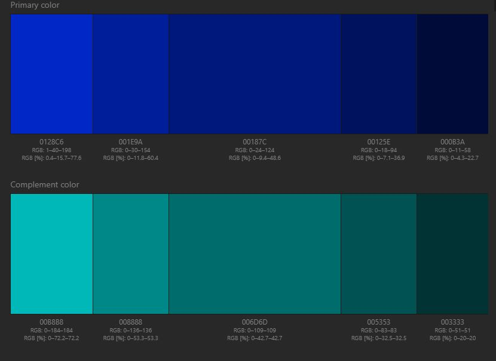
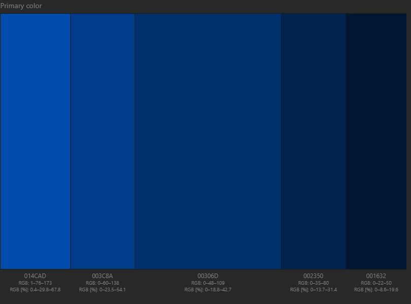
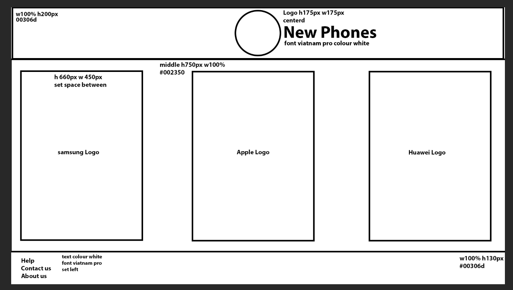

# Stakeholders

The stakeholders in an enterprise are any groups with an interest with how well it
satisfies their needs.

## Customers
+ quick loading
  + needs to load within a couple seconds
+ simple (easy to navigate)
+ product information
  + phone prices
  + device specifications
  + recomended phones
+ easily accessable

## Designers
+ well documented
+ maintainable
+ easy to test 
+ standards
+ timing
  + how long will it take to make?
  + how long have the been given to create?

## Owners 
+ cheap 
+ needs to look good 
+ professional and functional
+ genarate business

# Colour schemes
Color Palette by Paletton.com
#####  Palette URL: http://paletton.com/#uid=a3R3i0k++mOZDEL+Wsq+Yhm+RaK

 

   I have decided to use these colours because they are similar the the owners logo and the owner would like them to look similar.
   
   I will use the primary and secondary colours in backgrounds in my website, buttons and searchbars.

## Alternate colour scheme
Color Palette by Paletton.com
#####  Palette URL: http://paletton.com/#uid=1000u0kWL93GVi7QBdQ+f3L++00

I decided to use this colour for the alternate website design because I noticed some of the websites I was referencing used it like tesco mobile.

# Fonts
## Website one
for website one i have decided to use the Open Sans font because it was optimised for web layouts and mobile interfaces 
i found it on google fonts

<link rel="preconnect" href="https://fonts.googleapis.com">
<link rel="preconnect" href="https://fonts.gstatic.com" crossorigin>
<link href="https://fonts.googleapis.com/css2?family=Corinthia&display=swap" rel="stylesheet">

website used for phones https://www.techradar.com/uk/news/best-phone

## Website two
for website two, i will use Be Vietnam Pro because it is a Neo Grotesk which is well suited to tech companies. i got it from google fonts.

<link rel="preconnect" href="https://fonts.googleapis.com">
<link rel="preconnect" href="https://fonts.gstatic.com" crossorigin>
<link href="https://fonts.googleapis.com/css2?family=Corinthia&display=swap" rel="stylesheet">

# Storyboards
## Home page 

## Individual Phones

## Individual Accessories 

## Accessories and phone page storyboard

The accessories and phone page both use the same storyboard.
# Alternate Design

I did not use this design because the owners said it did not have enough detail and that it could have used more features.

# Asset List
## phones
These will be used as phones in my website.
+ Samsung Galaxy s21 ultra https://www.gizmochina.com/wp-content/uploads/2020/
+ 12/Samsung-Galaxy-S21-Ultra-Phantom-Black-Render-Leak.jpg

+ iphone 13 pro max
https://www.expansys.com.au/apple-iphone-13-pro-max-361875/

+ oneplus 9 pro https://specifications-pro.com/en/oneplus-9-pro/

+ iphone 13 https://www.bing.com/images/blob?bcid=RC3BMFrr9csDU

+ samsung galaxy s21 https://www.three.co.uk/samsung/galaxy-s21-5g?colour=phantom%20grey&memory=128&paym=true

+ xiaomi mi 11- https://th.bing.com/th/id/OIP.L8I3v-zKdeEQc1Ohs12adQAAAA?pid=ImgDet&rs=1

+ samsung Galaxy S21 plus- https://th.bing.com/th/id/OIP.JAhAlNGPBdHKBgBpsuEpwgAAAA?pid=ImgDet&rs=1
+ Oppo Find X3 Pro https://www.amazon.co.uk/Dual-SIM-256GB-Factory-Unlocked-Smartphone-Blue/dp/B08XY4Z6S9
## Cases
+ Samsung Galaxy S21 Case
+ Samsung Galaxy S21 Ultra Case
+ Samsung Galaxy S21 Plus Case
+ Iphone 13 Case
+ Iphone 13 Pro Max Case https://www.google.com/url?sa=i&url=https%3A%2F%2Fwww.apple.com%2Fuk%2Fshop%2Fproduct%2FMM2P3ZM%2FA%2Fiphone-13-pro-max-silicone-case-with-magsafe-clover&psig=AOvVaw2oDBtHKMAmOw9-CDZvygqg&ust=1650969177869000&source=images&cd=vfe&ved=0CAkQjhxqFwoTCLiEp82Br_cCFQAAAAAdAAAAABAJ
+ Oppo Find X3 Pro case https://www.onbuy.com/gb/case-oppo-find-x3-pro-hybrid-washable-fabric-finish-grey~c3340~p40045101/?exta=bingsh&stat=eyJpcCI6IjE2LjkwMDAiLCJkcCI6IjAuMDAwMCIsImxpZCI6NTM3MjM1NzYsInMiOiI5OSIsInQiOjE2NTAwNjY0ODEsImJtYyI6MH0=&exta=bingsh&msclkid=bcc51e912b2019351e5a7ccc6220c7c5&utm_source=bing&utm_medium=cpc&utm_campaign=(GB%3A%20SAD)%20Electronics%20%26%20Technology&utm_term=4575548924564644&utm_content=(GB%3A%20SAD)%20Electronics%20%26%20Technology%20-%2012
+ Xiaomi Mi 11 Case https://www.mytrendyphone.eu/shop/nillkin-camshield-xiaomi-mi-11-case-269327p.html
+ Oneplus 9 PRO Case https://www.spigenstore.com.au/spigen-oneplus-9-pro-tough-armor-2993956

# navigation
|                         | Home | Phones | Accessories | individual phones | individual accessories | help  | about us | contact us |
|-------------------------|------|--------|-------------|-------------------|------------------------|-------|----------|------------|
| Home                    |&#9745;|&#9745;|     &#9745; | &#9745;           |  &#9745;               |  &#9745;     |     &#9745;     | &#9745;           |
| Phones                  |    &#9745;  |  &#9745;      |        x     |          &#9745;         |              x          |     x  |        x  |   x         |
| Accessories             |    &#9745;  |   x     |     &#9745;        |      x             |         &#9745;               |    x   |   x       |        x    |
| individual phones       |   &#9745;   |      &#9745;  |       &#9745;      |         x          |          x              |  x     |      x    |      x      |
| individual accessories  |   &#9745;   |    x    |     &#9745;        |           x        |               &#9745;         |    x   |       x   |    x        |
| help                    |   &#9745;   |   x    |       x      |      x             |            x            |    x   |     x     |     x       |x
| about us                |  &#9745;    |    x    |     x        |       x            | x                       |    x   |       x   |     x       |x
| contact us              |   &#9745;   |    x    |    x         |      x             |     x                   |     x  |       x   |    x        |

